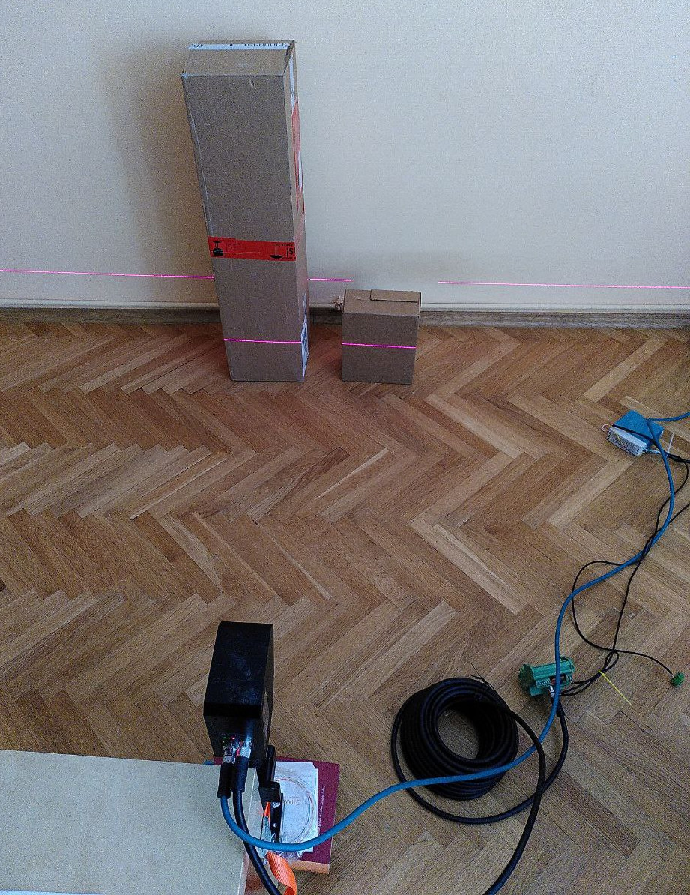
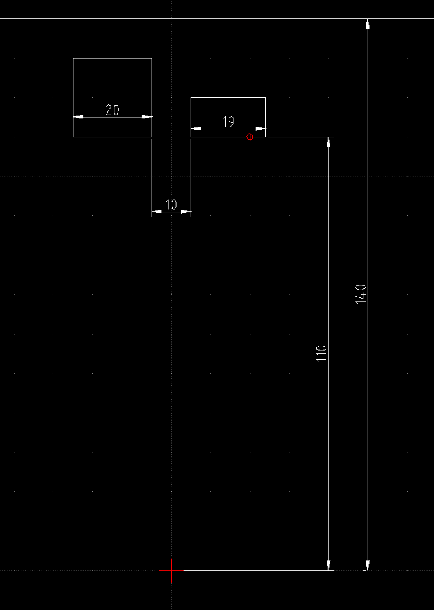

# AutomationTechnology SDK test

This minimal example uses AT SDK's [calculatePointCloud](http://docs.automationtechnology.de/software/cxsdk/Files/_point_cloud_8h/#function-calculatepointcloud) routine to convert sensor image data to physical coordinates.

In order to make it reproducible, all hardware access is eliminated by loading data from two files:

1. [range-buffer-50x2048-C16.bin](range-buffer-50x2048-C16.bin), as read from the sensor during acquisition. This contains the raw data to be converted.
2. [at-c6-factory-calibration.xml](at-c6-factory-calibration.xml), as downloaded from the sensor. This contains device-specific parameters necessary for the conversion.

## Acquisition scene 

The scene was plane with two boxes in the front:

Approximate distances (in centimeter) are drafted here, in the top-view:

The situation is included so that the computed physical coordinates can be validated against the original setup.

## Issue

Currently, the code fails produce meaningful data: `calculatePointCloud` returns cloud with zero points. The investigation of the issue is ongoing on the AT side.

